# Arquitectura del componente HPC/MPI — Diagrama de clases

Verde = ya implementado. Amarillo punteado = interfaz o clase diseñada pero pendiente de implementar.

```mermaid
classDiagram
    %% ===== hpc.auth =====
    class AuthProvider {
        <<interface>>
        +authenticate(username, credential) boolean
        +getUser(username) UserInfo
    }
    class FakeAuthProvider {
        -credentials Map
        -users Map
        +authenticate(username, credential) boolean
        +getUser(username) UserInfo
    }
    class UserInfo {
        -id String
        -username String
        -groups List
    }
    AuthProvider <|.. FakeAuthProvider : implementa
    AuthProvider ..> UserInfo : devuelve

    %% ===== hpc.runner =====
    class LanguageRunner {
        <<interface>>
        +compile(sourceFilePath, workingDirectory) CompilationResult
        +execute(binaryPath, args, nodes, workingDirectory) Process
    }
    class CRunner {
        +compile(sourceFilePath, workingDirectory) CompilationResult
        +execute(binaryPath, args, nodes, workingDirectory) Process
    }
    class CompilationResult {
        -success boolean
        -binaryPath String
        -compilerOutput String
    }
    LanguageRunner <|.. CRunner : implementa
    LanguageRunner ..> CompilationResult : devuelve

    %% ===== hpc.home (nuevo) =====
    class HomeFetcher {
        <<interface>>
        +resolve(reference) String
    }
    class TestHomeFetcher {
        +resolve(reference) String
    }
    class RepositoryHomeFetcher {
        +resolve(reference) String
    }
    HomeFetcher <|.. TestHomeFetcher : implementa
    HomeFetcher <|.. RepositoryHomeFetcher : implementa

    %% ===== hpc.cluster =====
    class NodeRegistry {
        <<interface>>
        +registerNode(nodeInfo)
        +unregisterNode(nodeId)
        +listAvailableNodes() List
        +listAvailableNodes(type) List
    }
    class InMemoryNodeRegistry {
        +registerNode(nodeInfo)
        +unregisterNode(nodeId)
        +listAvailableNodes() List
        +listAvailableNodes(type) List
    }
    class NodeInfo {
        -id String
        -hostname String
        -type NodeType
        -status NodeStatus
        -capacity int
    }
    class NodeType {
        <<enumeration>>
        FIXED
        MOBILE
        IOT
    }
    class NodeStatus {
        <<enumeration>>
        AVAILABLE
        BUSY
        OFFLINE
    }
    NodeRegistry <|.. InMemoryNodeRegistry : implementa
    NodeRegistry ..> NodeInfo
    NodeInfo --> NodeType
    NodeInfo --> NodeStatus

    %% ===== hpc.jobs =====
    class JobQueue {
        <<interface>>
        +enqueue(owner, codeRef, dataRef) String
        +getJob(jobId) Job
        +pollNext() Job
        +markCompleted(jobId, result)
        +markFailed(jobId, errorMessage)
        +retry(jobId)
    }
    class InMemoryJobQueue {
        +enqueue(owner, codeRef, dataRef) String
        +getJob(jobId) Job
        +pollNext() Job
        +markCompleted(jobId, result)
        +markFailed(jobId, errorMessage)
        +retry(jobId)
    }
    class Job {
        -id String
        -owner String
        -codeReference String
        -dataReference String
        -status JobStatus
        -result String
        -errorMessage String
    }
    class JobStatus {
        <<enumeration>>
        QUEUED
        RUNNING
        COMPLETED
        FAILED
    }
    JobQueue <|.. InMemoryJobQueue : implementa
    JobQueue ..> Job
    Job --> JobStatus

    %% ===== hpc.rmi =====
    class HpcClusterService {
        <<interface>>
        +submitJob(username, credential, codeRef, dataRef) String
        +getStatus(jobId) JobStatus
        +getResult(jobId) String
    }
    class RmiClusterServer {
        +submitJob(username, credential, codeRef, dataRef) String
        +getStatus(jobId) JobStatus
        +getResult(jobId) String
    }
    class AuthenticationException {
        <<exception>>
    }
    HpcClusterService <|.. RmiClusterServer : implementa
    HpcClusterService ..> AuthenticationException : lanza

    %% ===== hpc.worker (nuevo) =====
    class JobExecutionLoop {
        <<Runnable>>
        +run()
        +stop()
    }

    %% ===== Quien usa que =====
    RmiClusterServer --> AuthProvider : usa
    RmiClusterServer --> JobQueue : usa (enqueue/consulta)
    JobExecutionLoop --> JobQueue : usa (pollNext/mark)
    JobExecutionLoop --> HomeFetcher : usa
    JobExecutionLoop --> LanguageRunner : usa
    JobExecutionLoop --> NodeRegistry : usa (solo lectura)
```

**Ya implementado:** `AuthProvider`, `FakeAuthProvider`, `UserInfo`, `LanguageRunner`, `CompilationResult`, `NodeRegistry`, `NodeInfo`, `NodeType`, `NodeStatus`, `JobQueue`, `Job`, `JobStatus`, `HpcClusterService`, `AuthenticationException`.

**Pendiente de construir:** manejo de fallo de nodo + reintento automático desde `JobExecutionLoop` (tarea siguiente), y la clase `Main`/bootstrap que arranca todo (registra nodos, crea el hilo del loop, publica `RmiClusterServer` en el Registry).

**Ya implementado (actualización):** `HomeFetcher`, `TestHomeFetcher`, `RepositoryHomeFetcher`, `RmiClusterServer`, `InMemoryJobQueue`, `InMemoryNodeRegistry`, `CRunner`, y una pieza nueva no contemplada en el diagrama original: **`JobExecutionLoop`** (paquete `hpc.worker`) — el hilo en segundo plano que de verdad ejecuta los jobs (`pollNext()` → `HomeFetcher.resolve()` → `LanguageRunner.compile()`/`execute()` → `markCompleted`/`markFailed`). `RmiClusterServer` solo encola y responde consultas; nunca compila ni ejecuta nada él mismo, por eso hacía falta este componente aparte.

## Cómo leer el diagrama

- **`RmiClusterServer`** es el corazón del orquestador: implementa `HpcClusterService` (lo que el cliente invoca por RMI) y por dentro usa las otras cuatro piezas (`AuthProvider`, `HomeFetcher`, `LanguageRunner`, `JobQueue`, `NodeRegistry`) — nunca conoce sus implementaciones concretas, solo las interfaces.
- **`HomeFetcher`** tiene dos implementaciones intercambiables: `TestHomeFetcher` (para pruebas, sin depender del Home real) y `RepositoryHomeFetcher` (cuando esté lista la integración con el compañero del Home).
- Los `enum` (`NodeType`, `NodeStatus`, `JobStatus`) y las clases de datos (`UserInfo`, `NodeInfo`, `Job`, `CompilationResult`) son las que viajan entre las piezas, cargando la información necesaria sin acoplar unas implementaciones a otras.
- Todo lo que sigue en amarillo (`CRunner`, las versiones en memoria de `NodeRegistry`/`JobQueue`, y `RmiClusterServer`) es lo que falta por construir en las tareas siguientes.
